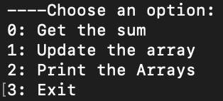

# Program to calculate sum and change elements of array by constructing a Binary Index Tree
Using BIT, time complexity of calculating the sum of elements upto ith index and changing the elements of an array is reduced to `Ω(logn)`.
To compile and run:

    $ gcc bit.c -o p
    $ ./p
    
Initially the program asks for the number of elements in the array and then the array itself. It then proceeds to create a BIT for the given array.
After creation it promps the user to select one of the following options:

  
