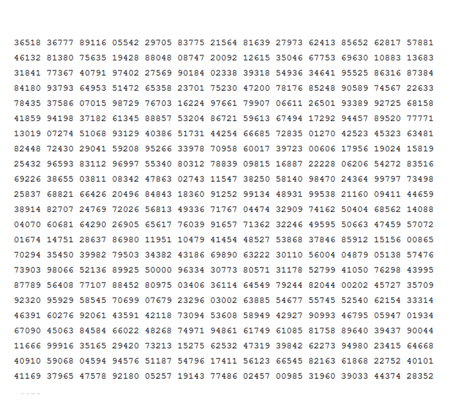
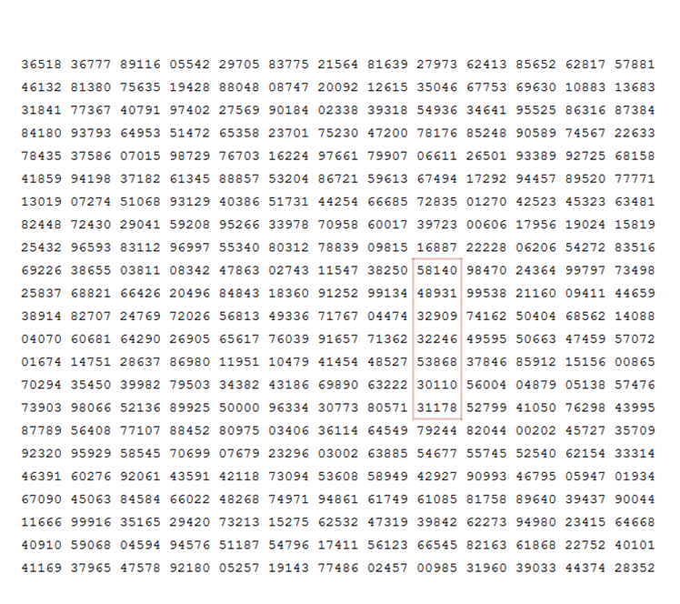

# C code that searches for a pattern in NxN puzzle.
Takes in a NxN matrix as input and the pattern to look for.  
N is defined in Macros.  
Compile and run:  

    $ gcc pattern.c -o pattern
    $ ./pattern 

N2 elements are input at the start. This will be the puzzle to find a pattern in.  
Number of elements to look for and the pattern are entered next.

###### *Assume the following puzzle is given as input:*  
  

Following this, the number of elements in the pattern and the pattern to look for are given as inputs:

> no of elements to search:  
> 7  
> Pattern to look for:  
> 31178 30110 53868 32246 32909 48931 58140  

Since the pattern exists, an output is given mentioning the location of the pattern.  
  
`at (9, 16) going up` indicates the x and y cordinates of the start of the pattern.
###### *Note: The search happens only in the four directions. Up, down, left, right i.e no diagonal search.*

