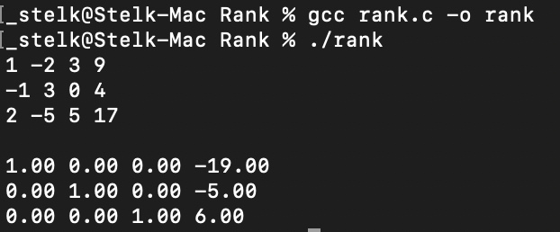
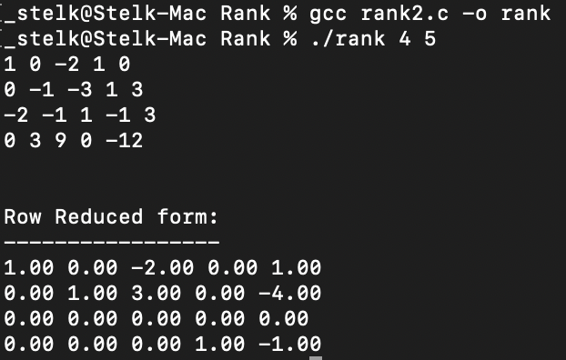

# C code to output the row-reduced form a matrix
**rank.c** requires number of rows and columns as macros definations while **rank2.c** needs these inputs as cmd line args. 
**rank2.c** is my first shot at working with 2D arrays completely via pointers which required great deal of carfulness and imagination.

---

## rank.c
Change marcos definations of *row* and *clmn* to work with the required matrix.  
Compile and run:

    $ gcc rank.c -o rank
    $ ./rank.c

Input the matrix elements. Irrespective of the way you input them, the code takes first 'row' number of elements as inputs for first row, second 'row' number of elements as second and so on. 
On entering *row* x *clmn* number of elements, the row reduced form is printed to the terminal.  
###### **Example** with *row* = 4 and *clmn* = 5

---

## rank2.c
Command line args are to represent number of rows and columns. `argv[1]` will be the number of rows of the matrix and `argv[2]` will be the column number.   
Compile and run:

    $ gcc rank2.c -o rank
    $ ./rank.c 4 5 

Input the matrix elements. On entering `argv[1] x argv[2]` number of elements, the row reduced form is printed to the terminal.  
###### **Example** with *argv[1]* = 4 and *clmn* = 5

